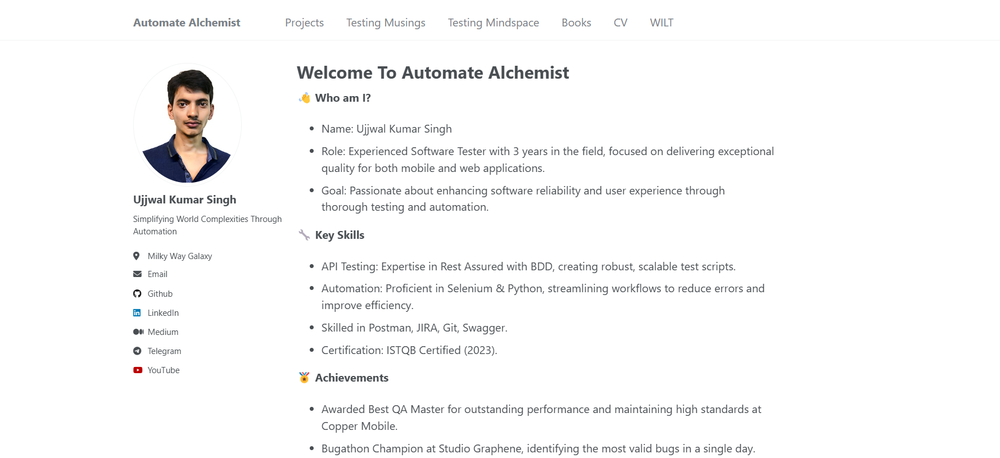

# Automate Alchemist
**This repo contains code for the portfolio website automatealchemist.github.io.**

# https://automatealchemist.github.io/

1. This website contains links to the public repo of the automation framework I created.
2. It contains details about what I learned from the missed bugs.
3. It contains my updated resume.
4. It contains testing-related information and resources.
5. It contains links to channels on various platforms.
   
See more info at [https://academicpages.github.io/](https://automatealchemist.github.io/)

